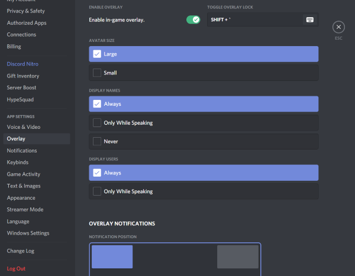

# among-us-name-tag-overlay
The goal of this program is to make it easier to see who is speaking in the social deduction game "Among Us". When you are in a new group and don't know how the other players voices sound like yet, it can get confusing, even with the Discord overlay turned on.
The program displays nametags for people that are in your Discord voicecall during Among Us meetings. The nametags are draggable so you can drag them onto the players. They will blink when the person speaks. Once they are attached to a color, they will appear next to this player on the following meetings.

Note that the program works by taking screenshots and checking which Discord overlay rows are highlighted to khow who is speaking. It will not work if the Discord overlay is not visible or when it isn't where the program expects it to be (see the expected seetings below).
It also uses screenshots to determine if there is currently an active meeting and other things.

### Setup
You will need your discord token ([here](https://www.youtube.com/watch?v=xuB1WQVM3R8) is a video showing how to get it). Once you have it you have to paste it into the config.ini file in the line "DISCORD_TOKEN = YOUR_TOKEN" replacing "YOUR_TOKEN" with it.

You need to have this discord overlay settings: 

### Usage
While the program is running it will show the draggable nametags when inside a Among Us meeting. There are hotkeys for pausing and quitting (by default ctrl+< and ctrl+alt+w).

### Limitations
+ Windows only
+ works only with a screen resolution of 1920x1080
+ works only with a enabled Discord overlay, with the default overlay settings
+ somewhat resource-intensive
